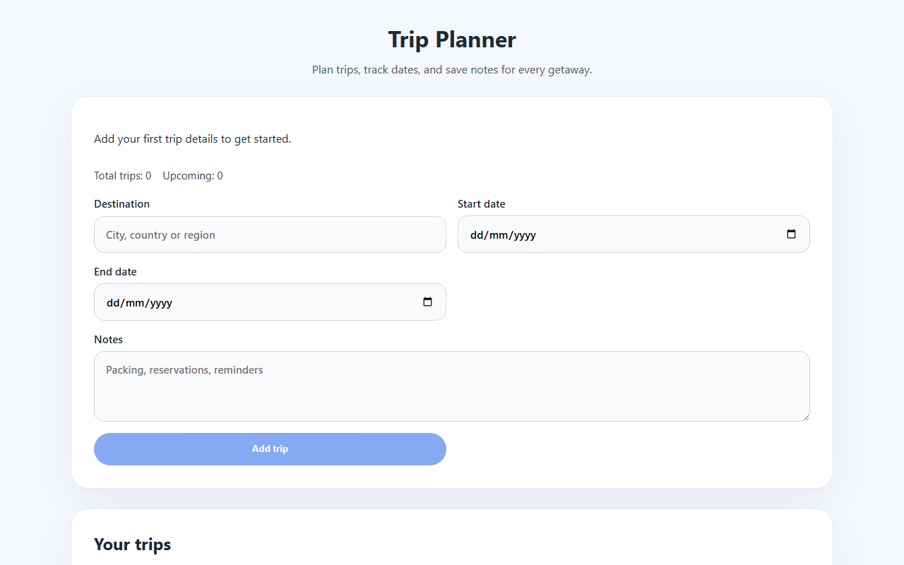

# Trip Planner

A lightweight React + Vite trip planner for adding destinations, dates, and trip notes.

Live demo: https://markristian-cmd.github.io/Trippy/



## Getting started

1. Install dependencies:

   ```bash
   npm install
   ```

2. Start the development server:

   ```bash
   npm run dev
   ```

3. Open the local URL shown in the terminal.

## Features

- Add and remove planned trips
- Track destination, start and end dates, and notes
- View trip count and next upcoming trip date
- Download your itinerary as a text file

## Tech stack

- [React](https://react.dev/) + TypeScript
- [Vite](https://vitejs.dev/)
- Vanilla CSS (no UI library)

## Project structure

- `src/App.tsx` — main planner UI and all state logic
- `src/main.tsx` — React entry point
- `src/styles.css` — global styles
